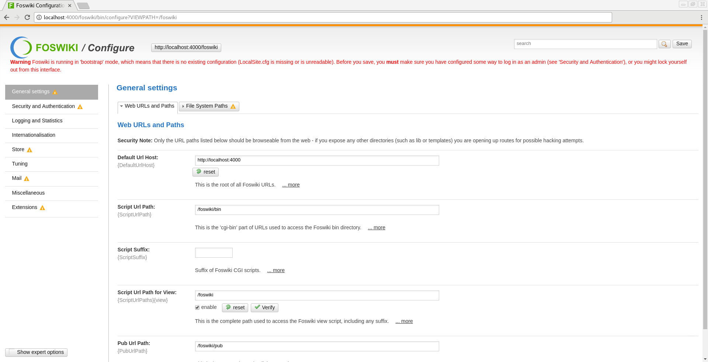
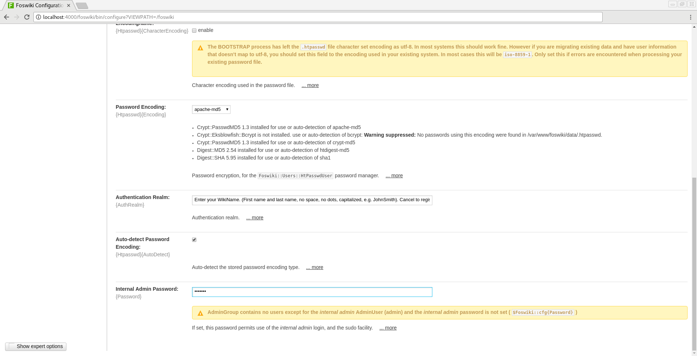
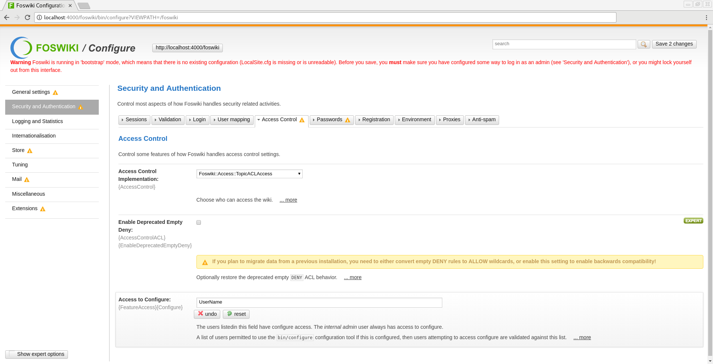
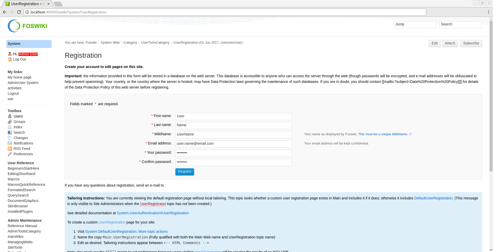
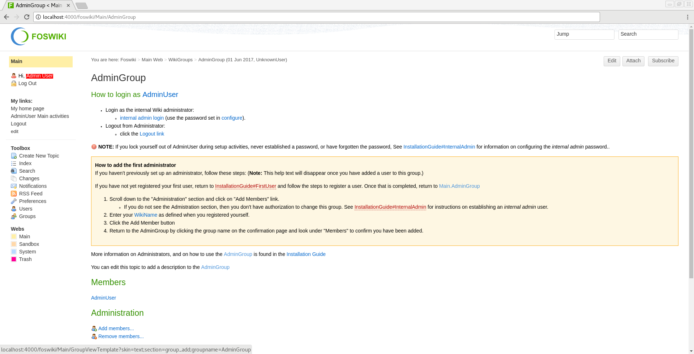
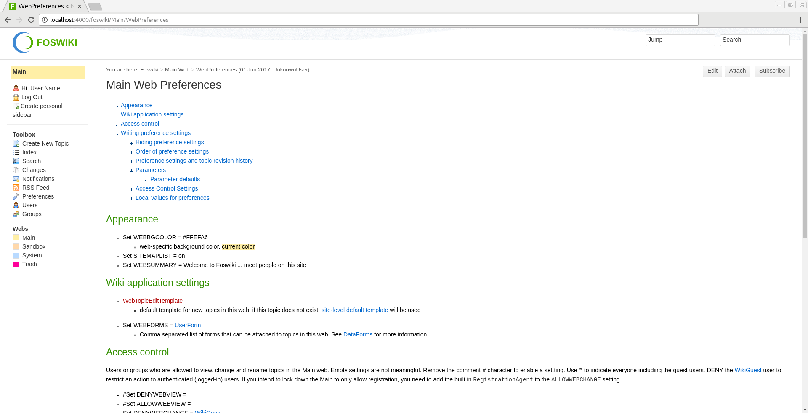
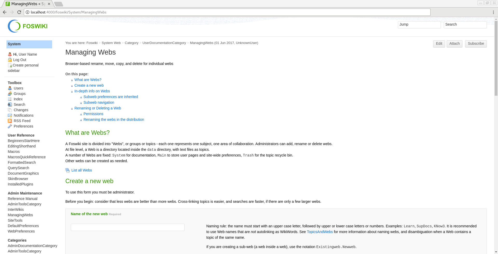

# ubuntu-foswiki

[](https://github.com/andreysmelter/ubuntu-foswiki)
[](https://hub.docker.com/r/andreysmelter/ubuntu-foswiki)
[](https://hub.docker.com/r/andreysmelter/ubuntu-foswiki)


This `Dockerfile` contains instructions on how to build an image with Foswiki 2.1.5 based on Ubuntu 16.04 (LTS).


## Links:

   * [@GitHub](https://github.com/andreysmelter/ubuntu-foswiki)
   * [@DockerHub](https://hub.docker.com/r/andreysmelter/ubuntu-foswiki/)


## Install

1. Install `docker`:
   * Follow instructions to install docker for your system: https://docs.docker.com/engine/installation
2. Install `ubuntu-foswiki`:
   * `pull` built image from the docker hub:
   ```
   # docker pull andreysmelter/ubuntu-foswiki
   # docker tag andreysmelter/ubuntu-foswiki:latest ubuntu-foswiki:latest  # retag docker image
   # docker rmi andreysmelter/ubuntu-foswiki                # remove after you have retagged it
   ```
   * or `build` an image using `Dockerfile` at the root of this repo by running `docker build` from directory containing `Dockerfile`:
   ```
   # docker build -t ubuntu-foswiki .
   ```


## Run Foswiki

1. To `run` Foswiki:
```
# docker run -t -p 4000:80 ubuntu-foswiki
```
2. Go to the following address: `http://localhost:4000/foswiki`

The image contains unconfigured Foswiki installation where you will need to save paths, 
set `admin` password, register `user`, etc.


## Configure Foswiki

### Foswiki Tutorial

Visit Foswiki Documentation to learn more:
   * [Documentation](https://foswiki.org/System/WebHome)

Slide show presentation for beginners:
   * [Presentation](https://foswiki.org/System/BeginnersStartHere?slideshow=on;cover=slideshow#GoSlide1)


### General Configuration

1. Visit `configure` page (follow the link from the main page).
   

2. Add `Internal Admin Password` under **Security and Authentication** -> **Passwords**.
   

3. Add your `UserName` to `Access to Configure` (users who can access `configure` page) under **Security and Authentication** -> **Access Control**.
   

4. Save `configure` page.
5. Go to `http://localhost:4000/foswiki/System/UserRegistration` and register your `UserName`.
   

6. Go to `http://localhost:4000/foswiki/Main/AdminGroup` and add your `UserName` to `AdminGroup`.
   


### Additional Configuration

* To protect main page with login screen:

   1. Go to `http://localhost:4000/foswiki/Main/WebPreferences`.
   2. Under **Access control** find **Set ALLOWWEBVIEW =** and change it to **Set ALLOWWEBVIEW = AdminGroup**.
   3. Under **Access control** find **Set ALLOWWEBCHANGE =** and change it to **Set ALLOWWEBCHANGE = RegistrationAgent**.
      


* To create new webs:

   1. Go to `http://localhost:4000/foswiki/System/ManagingWebs`.
   2. Create new `Web`.
      
